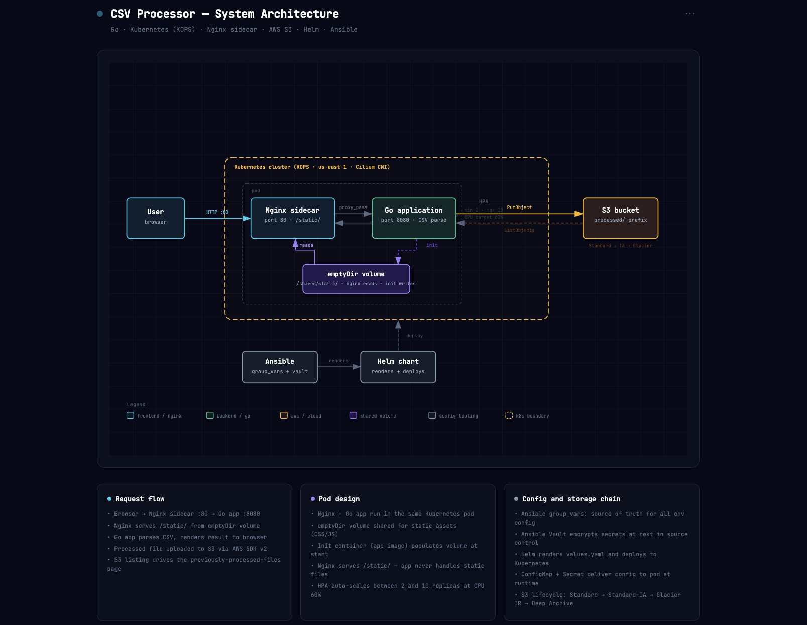

## Architecture

 _Full architecture diagram available in the diagram-architecture.html_


The application consists of a single Go service that serves an HTML page with a file upload form. When a user uploads a CSV file, the service processes the file and returns a formatted response. The application uses an Nginx sidecar to serve static assets and HTML templates, while the Go service handles the business logic and routing.

The static assets and templates are stored in the application image and shared with the Nginx sidecar via an `emptyDir` volume. The Go service uses `template.ParseFiles()` to load HTML templates at startup, while Nginx serves static files from the shared volume.

The application is deployed in a Kubernetes cluster, with a single Pod containing three containers: an init container that copies static files to the shared volume, the Go application container, and the Nginx sidecar container. The Nginx configuration is set up to serve static files from the shared volume and proxy all other requests to the Go application on port 8080.


The Go application is designed to upload the parsed files to a configured S3 bucket, and to list previously processed files from the same bucket. 

However, if S3 is unavailable or not configured, the application gracefully degrades by skipping the S3 upload step and rendering an empty file list with a warning banner on the index page. The application never panics or crashes due to S3 issues, ensuring continuous availability of the core functionality.

## Project Structure

```
app/                  Go source (handlers, csvparser, templates, static)
helm/csv-processor/   Helm chart (Deployment, Service, HPA, ConfigMap, SA)
ansible/              Deploy automation  - renders values.yaml, runs helm upgrade
k8s-cluster/          KOPS cluster + instance group manifests
terraform/            S3 bucket infra (not applied  - see terraform/README.md)
```


## Tradeoffs

### 1. go:embed vs Nginx Sidecar: 

Initially, I considered using `go:embed` to compile static assets and templates directly into the Go binary for simplicity. However, the requirement for an Nginx sidecar to serve static files made this approach infeasible. Using an Nginx sidecar allows for better separation of concerns and more efficient serving of static assets, but it adds complexity to the deployment and requires additional configuration.

### 2. S3 Integration: 

Integrating S3 for file storage provides scalability and durability, but it introduces external dependencies that can fail and impact the application's availability. To mitigate this, I implemented graceful degradation to ensure the application remains functional even when S3 is unavailable, but this adds complexity to the codebase and requires careful handling of edge cases.

### 3. Testing and Validation: 

Given the time constraints of the case study, I focused on implementing core functionality and ensuring the application meets the requirements. Comprehensive testing, including unit tests, integration tests, and end-to-end tests would be ideal in a production ready scenario.
However, I focused on writing simple test cases for the core csvparser logic, and did not implement extensive testing for the S3 integration or Kubernetes deployment, which would be necessary for a production ready application.


## Design Decisions

1. Use `template.ParseFiles()` for HTML templates and an Nginx sidecar for static assets, as per the architectural requirement.

2. Implement graceful degradation for S3 integration to ensure the application remains functional even when S3 is unavailable.

3. Used a side car architecture to separate concerns between serving static assets and handling application logic, which allows for better scalability and maintainability.

4. Chose to deploy the application in a local kind cluster for ease of testing and development, while ensuring the deployment configuration is compatible with production Kubernetes environments.

5. All helm chart configuration values are managed via a custom `values.yaml` file that is generated via an ansible playbook, allowing for easy customization and deployment in different environments without modifying the underlying templates.

6. Cilium was chosen over Calico for the cluster CNI due to its eBPF dataplane, built-in telemetry with Hubble, kube-proxy replacement capabilities and my personal experience using it in previous roles. However, Calico would be a safer default for teams unfamiliar with eBPF debugging.


## Deployment

The application is deployed using Helm charts, which provide a convenient way to manage Kubernetes resources and configurations. The Helm chart includes templates for the Deployment, Service, and ConfigMap resources required to run the application in a Kubernetes cluster.

Ansible is used to generate the `values.yaml` file for the Helm chart, allowing for easy customization of configuration values such as the S3 bucket name, AWS credentials, and other application settings. This approach ensures we can secure the application configuration and avoid hardcoding sensitive information in the Helm templates.

The application can be deployed via the Ansible playbook, which renders the `values.yaml` file and runs `helm upgrade` to deploy the application to the Kubernetes cluster. This deployment process allows for repeatable and consistent deployments across different environments, while also providing flexibility for customization through Ansible variables.

## Security Considerations

1. **No static credentials IRSA + OIDCs** - We use IRSA (IAM Roles for Service Accounts) to grant the application permissions to access S3 without hardcoding AWS credentials in the cluster.
2. **Minimal exposure** -  The application does not expose any unnecessary ports or services, and the Nginx sidecar is configured to only serve static assets and proxy requests to the Go application on port 8000.

3. **Hardened containers** - The containers are configured with `runAsNonRoot`, `readOnlyRootFilesystem`, `capabilities: drop: [ALL]` on all containers including init.
4. **Encrypted secrets** - `all.vault.yaml` is ansible-vault encrypted; vault password provided at deploy time, never stored in the repo.
5. **S3 hardened** - Versioning, AES-256 SSE, all public access blocked; server-side only access via IRSA.


